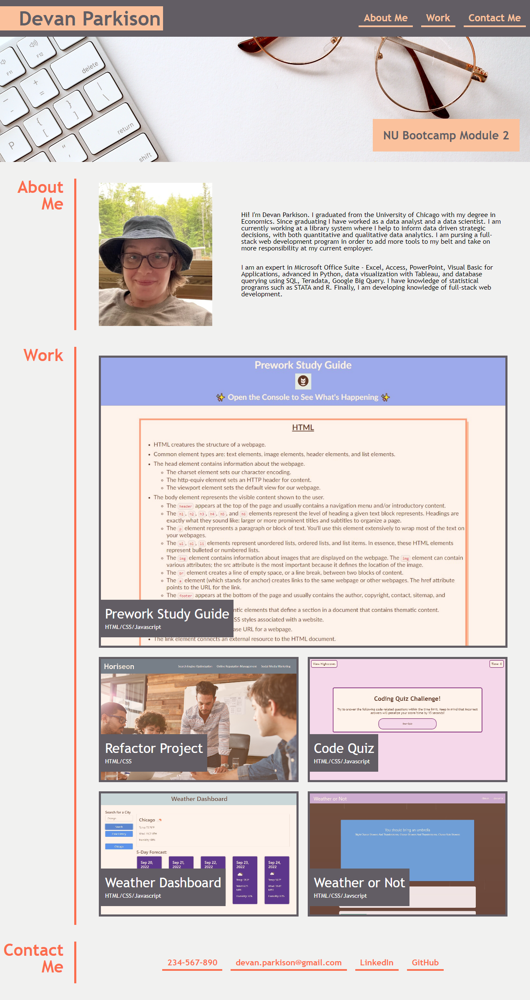

# Module-2 Challenge: Parkison - Professional Portfolio

## Description

In order to learn more Advanced CSS topics, I created my own web application from scratch for my professional developer portfolio. This portfolio of work will showcase my skills and talents to future employers. At this point in my career, my portfolio does not have enough web applications to showcase, so there are placeholder links and images in the "work section".

## Installation

N/A

## Usage

Application deployed at the following link: https://park-d.github.io/module-2/

At the top of the webpage is my name and a nav bar that contains 3 links, one to each major section of the webpage. Each link will take the user to the corresponding section in the webpage. The "About Me" section contains my headshot as well as text about me and my career. The "Work" section has titled images of my applications. Where I did not have enough applications to fill in the section, there are placeholder links. The final section "Contact Me" contains contact information: phone number, email, linkedin, and github.

## Credits

During the begining stages and planning stages of the Module-2 Challenge, I was in a study group with Jackson Myhre and Roy Logan from the same bootcamp class.

## License

N/A